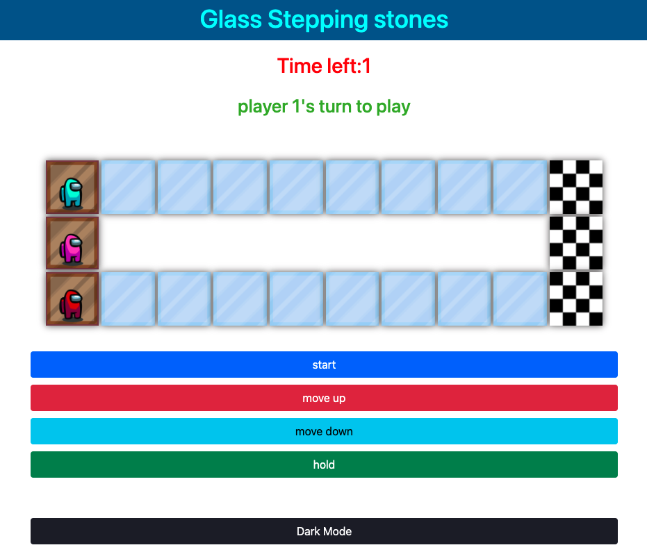
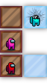
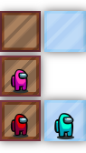
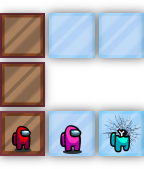
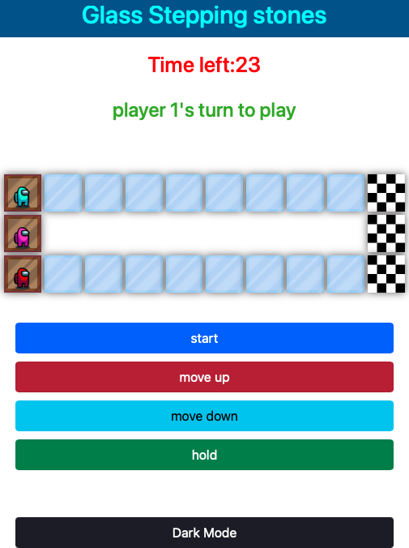
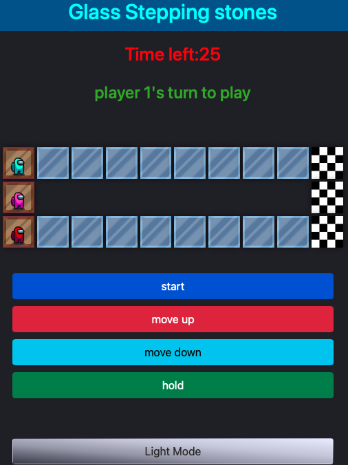

# Glass-Stepping-Stones

## Description

By now you must have seen or at least heard of the show "Squid Games" because... who hasn't? One of the most difficult and intense games in the show is, you guessed it , "The Glass Stepping Stones". The game's design is similar to hopscotch but with different rules which will be explained in a moment. It only makes sense by now that you're able to try it and test your luck (with out betting your actual life on it :stuck_out_tongue_closed_eyes:) .
###### Game's Design 

The players have to cross a bride to get to the other side in-order to pass the game. The bridge is made up of glass panels that are seperated between small gaps. On each row, one panel is safe and one panel is rigged so that it breaks upon the lightest weight on it. However, players cannot tell the difference between the two !!

[Click Me To Jump Right Into The Game!](https://glass-stepping-stones.netlify.app)

## Rules

The rules are fairly simple : 

* Players take turns and jump forward.
* Each player on their turn chooses which panel they want to jump on. (top/bottom)

    

* Each player has the option to hold position, if they do do not wish to jump.
* If a player wishes to hold their position, the next player now has the extra option "push" which enables them to push the person infront of them to the panel straight ahead if no player exist on it.
  
  

### Extra features

 Light/Dark Mode 

  

### Tech Used 

* HTML
* JavaScript
* CSS
* Bootstrap

#### shoutouts 
* Bootstrap - for buttons

#### Future Endeavors

* Add in a tutorial option to clarify game rules
* Ability to choose number of players
* Ability to add AI players
* Ability to choose the number of tiles
* Ability to choose character skin
* Add audio: music and sound effects

#### Credits & References

* Broken-Glass styling: [AdobeStock](https://stock.adobe.com/images/broken-glass-vector-drawing/135152157)
* Checkered flag: [AdobeStock](https://stock.adobe.com/images/checkered-flag-race-background-racing-flag-race-banne[…]ard-checker-background-stock-vector/432684499?prev_url=detail)

